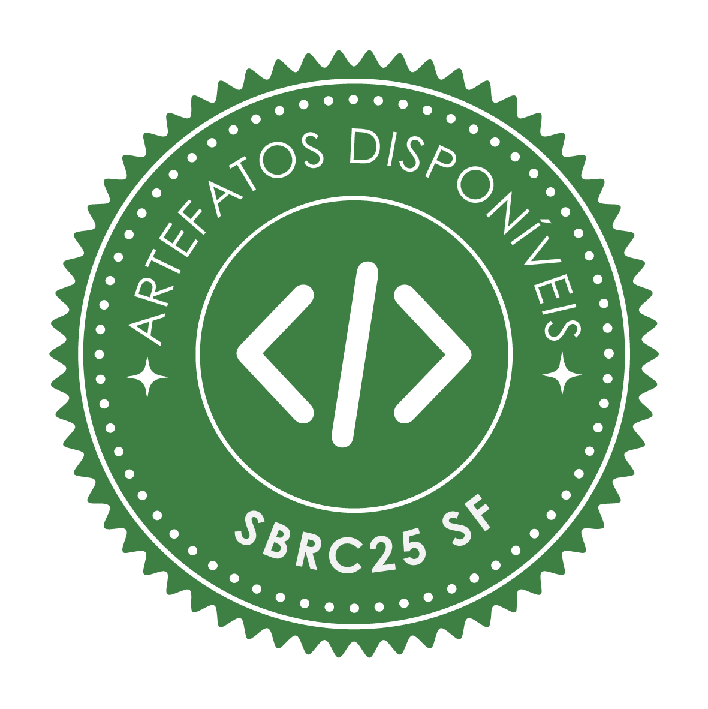
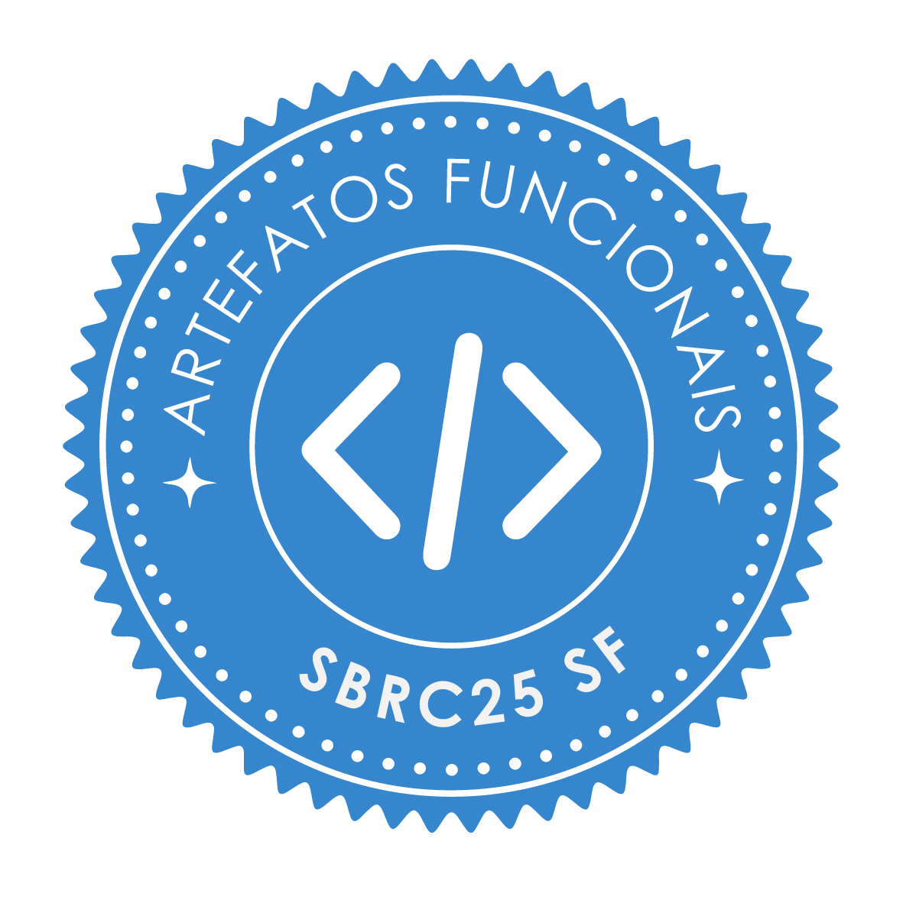
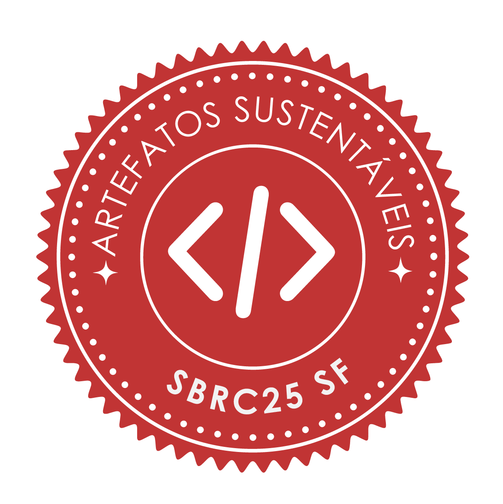
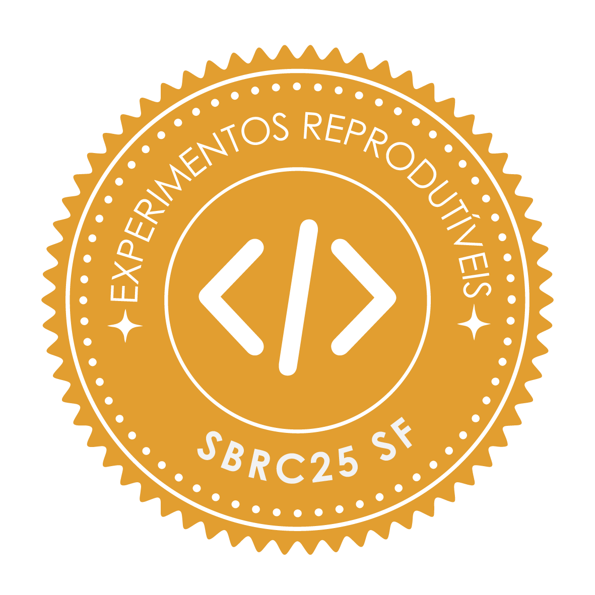

# RAGtrap: Source Revocation and Indexed Provenance Lookup for Poisoned RAG Corpora

<p align="center">
  <a href="https://doc-artefatos.github.io/sbseg2026/results.html">
    
    
    
    
  </a>
</p>

<p align="center"><sub>Official SBSeg 2026 artifact-evaluation seals awarded to this artifact (WTICG): Available, Functional, Sustainable and Reproducible. <a href="https://doc-artefatos.github.io/sbseg2026/results.html">Official results</a>. Seal artwork by the SBSeg Artifact Evaluation Committee.</sub></p>

Retrieval-augmented generation (RAG) answers questions from passages retrieved out of a corpus, and poisoned passages can steer those answers: in a published attack, 5 passages per target question sufficed to produce the attacker's chosen answer. Once a source is known to be compromised, recovery means finding the passages it supplied and removing them without discarding unrelated content. RAGtrap records a signed provenance entry for every passage at ingestion, indexed by source and by content hash. Tracing a suspect passage is then one hash lookup and no language-model request, against one or more per passage for post-incident attribution in the literature. Revoking a source removes only its passages, whereas deleting whole documents also discards benign ones. Exact hashing cannot attribute content changed after ingestion, nor content supplied by more than one source, so RAGtrap supports recovery from a known compromised source but does not detect or prevent poisoning.

*The paragraph above is the paper's abstract, with its macros resolved. Two notes that belong to the artifact rather than to the paper: the measured false-purge rate is 0.00 for source revocation against 0.52 for document-level removal, and recall falls to 0.69 under 30% post-ingestion drift; and the prototype uses an in-memory datastore, so its latency results measure the index algorithms rather than end-to-end vector-database remediation.*

> **Paper:** *RAGtrap: Source Revocation and Indexed Provenance Lookup for Poisoned RAG Corpora* (SBSeg 2026).

> **SBSeg 2026 artifact evaluation.** Review instructions: [submission](https://doc-artefatos.github.io/sbseg2026/subinstrucoes.html) / [review](https://doc-artefatos.github.io/sbseg2026/revinstrucoes.html).

> **For the artifact evaluation, this README is the only file you need to read.** The other Markdown files in the repository are complementary: they document internals and go deeper than the review requires.

---

## README Structure

| Section | Description |
|---|---|
| [Considered Seals](#considered-seals) | SBSeg quality seals targeted by this artifact |
| [Basic Information](#basic-information) | Hardware, OS, and software environment |
| [Dependencies](#dependencies) | Key pinned packages and how third-party inputs are fetched |
| [Security Concerns](#security-concerns) | What runs locally, where keys/data live, network use |
| [Installation](#installation) | Steps 1-4: host tools, clone, install uv, `uv sync`. No experiment runs here |
| [Execution](#execution) | Every run command, in order, with its time and what it produces |
| [Minimal Test](#minimal-test) | Execution step 1: one-command end-to-end functional check (~1 s) |
| [Experiments](#experiments) | Execution steps 2-7: reproduction of the paper's claims (check + Exp. 1-3) |
| [Cleaning up](#cleaning-up) | One command removes what a run created |
| [License](#license) | Licensing information |
| [How to cite](#how-to-cite) | Paper reference and machine-readable `CITATION.cff` |

The repository is organized as follows:

| Path | Contents |
|---|---|
| [`src/ragtrap/`](src/ragtrap/) | The package, one module per concern: `gate`, `signing`, `datastore`, `traceback`, `revocation`, `realeval`, `scaling` |
| [`scripts/`](scripts/) | The reviewer's entry points: [`minimal_test.sh`](scripts/minimal_test.sh), [`claim1.sh`](scripts/claim1.sh), [`claim2.sh`](scripts/claim2.sh), [`claim3.sh`](scripts/claim3.sh), and the input fetcher |
| [`data/`](data/) | The frozen, checksum-pinned BEIR sample used by the fast path |
| [`results/`](results/) | The run of record: [`results.json`](results/results.json), the per-experiment outputs and [`macros.tex`](results/macros.tex) |
| [`expected/`](expected/) | [`paper_macros.tex`](expected/paper_macros.tex): the frozen camera-ready values, 98 of them |
| [`tests/`](tests/) | The 33 offline unit tests |
| [`cleanup.sh`](cleanup.sh) | Removes everything a run created |

---

## Considered Seals

The seals considered are: **Available (SeloD)**, **Functional (SeloF)**, **Sustainable (SeloS)**, and **Reproducible (SeloR)**.

- **Available (SeloD):** self-contained public repository under the MIT license, with a pinned dependency set ([`pyproject.toml`](pyproject.toml) + [`uv.lock`](uv.lock)). Every input is public and third-party, fetched and checksum-pinned at run time; the clean BEIR substrate for the fast path ships frozen in [`data/`](data/).
- **Functional (SeloF):** one command, [`scripts/minimal_test.sh`](scripts/minimal_test.sh), runs signing → indexed traceback → source revocation end to end and the 33-test unit suite (no network, no GPU), asserting `instrument_valid: true`.
- **Sustainable (SeloS):** `src/` layout, one module per concern (23 modules under [`src/ragtrap/`](src/ragtrap/): `gate`, `signing`, `datastore`, `traceback`, `revocation`, `realeval`, `scaling`, …), type hints, docstrings, 33 unit tests, and a clean ruff check.
- **Reproducible (SeloR):** the default experiment is **deterministic** (fixed seeds) and **model-free**. Small inputs are pinned by SHA-256, the frozen BEIR sample ships in `data/`, and the full BEIR snapshot is pinned to an immutable revision.

---

## Basic Information

| | |
|---|---|
| **OS** | Linux (x86_64); validated on Ubuntu/Debian, kernel 6.17 |
| **Python** | 3.10+ (validated on 3.12 and 3.13), managed by [`uv`](https://astral.sh/uv) |
| **RAM** | Fast path (minimal test, Claim \#1, Claim \#2): < 1 GB. **`./scripts/claim3.sh --run` on the CPU is the one memory-hungry step: 16.9 GiB peak measured, so plan for 20 GB free** (on a GPU that same step runs in ~6 GB of VRAM instead; we did not measure its host-RAM peak) — see [Claim \#3](#claim-3-attack-success-context-the-suspects-are-genuinely-harmful). Full `--full` scaling point builds ~4.4M signed records and uses up to ~10 GB |
| **Disk** | `.venv` after `uv sync`: ~333 MB; fast path adds nothing (337 KB sample ships in git). `--full` adds ~764 MB (BEIR corpus) + a few GB (local model) under `$RAGTRAP_DATA_ROOT` |
| **GPU** | **Not required** for the minimal test or the main claim. Only the `--full` model-served baselines (Exp. 1 LLM judge / RAGOrigin proxy, Exp. 3 generation) use a single CUDA GPU |
| **Host tools** | `git` and `curl`, used by the installation steps and by the one-time fetch of the two third-party inputs. Nothing else is installed outside the project's `.venv` |
| **Reference machine** | x86_64, 32 GB RAM, Python 3.13, no GPU; minimal test ~1 s, fast main experiment ~10 s |

---

## Dependencies

This section lists *what* the artifact depends on. The commands that install it are steps 1 to 4
of [Installation](#installation).

**Host tools:** `git` (to clone), `curl` (to fetch the uv installer) and `uv`. **No Docker, no compiler, no GPU driver.** Every claim script checks for `uv` before doing any work and prints the installer plus the PATH line the installer cannot apply to the shell that ran it.

All packages are pinned in [`pyproject.toml`](pyproject.toml) / [`uv.lock`](uv.lock) and installed by `uv sync` (no manual step):

- **Core / fast path:** `cryptography` (real Ed25519 signing), `datasets`, `huggingface-hub`, `pyarrow` (loads the shipped sample and the small third-party attack files).
- **Dev (installed by default):** `pytest`, `ruff`.
- **`eval` extra (`--full` only):** `torch`, `transformers`, `sentence-transformers`, `scipy`, `accelerate`: the dense retriever plus the local model that serves the LLM-judge / proxy baselines. Installed with `uv sync --extra eval`.

**Third-party inputs are obtained, not vendored, and pinned by SHA-256 at fetch time** (by `uv run python scripts/fetch_inputs.py`, called automatically by the experiment script):

- RAGOrigin attack-feedback (labelled suspects + baseline substrate): `github.com/zhangbl6618/RAG-Responsibility-Attribution` (shallow clone, ~6 MB).
- PoisonedRAG `nq.json` (the attack): `github.com/sleeepeer/PoisonedRAG` (sparse blobless clone, ~120 KB).
- BEIR/nq corpus (`--full` only, ~764 MB): Hugging Face `BeIR/nq`.

The clean BEIR substrate for the fast path is the frozen, checksum-pinned `data/beir_nq_sample.parquet` already in the repository, so the fast path's only network use is the two small clones above.

---

## Security Concerns

- The artifact runs **only locally**: its own code plus the listed PyPI packages and the two cloned baseline repositories; corpus text is hashed, signed, indexed, and compared as data, **never executed**.
- The Ed25519 **private key is generated per run and never written to disk**; only the non-secret public-key identity is logged and recorded in the manifest. `.gitignore` excludes `*.key`.
- **No credentials are required.** The `--full` baseline judge runs against a local open model on the GPU; the fast path makes no model calls and no API calls.
- **Network** is used once, only to fetch the two small third-party files (fast path) or additionally the corpus + model (`--full`). Heavy data lives under `$RAGTRAP_DATA_ROOT` (default `~/.cache/ragtrap`), never inside the repository.

---

## Installation

Installation is four steps and touches nothing outside the project's `.venv`. No command in this
section runs an experiment; the commands that do are in [Execution](#execution).

**Step 1 — install the two host tools.** Only `git` and `curl` are needed; pick the line for your
distribution.

```bash
sudo apt-get update && sudo apt-get install -y git curl   # Debian, Ubuntu
sudo dnf install -y git curl                              # Fedora, RHEL
sudo pacman -Sy --needed git curl                         # Arch
sudo zypper install -y git curl                           # openSUSE
```

**Step 2 — get the artifact.**

```bash
git clone https://github.com/CristhianKapelinski/sbseg2026-ragtrap
cd sbseg2026-ragtrap
```

**Step 3 — install `uv`** (skip if you already have it). The installer places `uv` in
`~/.local/bin`, which the shell that ran the installer only picks up after the `export` below or
after a new login shell.

```bash
curl -LsSf https://astral.sh/uv/install.sh | sh
export PATH="$HOME/.local/bin:$PATH"   # the current shell needs telling
```

**Step 4 — install the pinned dependencies.** This creates `.venv` from `uv.lock`; there is no
`pip`, `venv`, or `requirements.txt` step.

```bash
uv sync
```

`uv sync` took **~14.5 s** on the reference machine with a cold uv cache (downloading wheels) and
**~1.5 s** to rebuild the environment with a warm cache. The heavy `eval` extra is *not* installed
by this step; only the optional `--full` run needs it, and it is documented where it is used.

**Check that installation worked** (this only prints the version; it runs no experiment):

```bash
uv run ragtrap --version
```

---

## Execution

Run every command below from the repository root, with the `.venv` already created by
[Installation](#installation). The scripts drive `uv run` themselves and check that `uv` is on
`PATH` before doing any work. Each step is independent, so you can stop after any of them; steps 1
to 3 are all an evaluation needs and take under 20 seconds together, on CPU.

| Step | Command | What it is | Time |
|---|---|---|---|
| 1 | `./scripts/minimal_test.sh` | The functional check, end to end, plus the unit suite. No network, no dataset, no GPU | ~1 s |
| 2 | `./scripts/claim1.sh` | Claim \#1, recomputed on your machine | ~7 s |
| 3 | `./scripts/claim2.sh` | Claim \#2, the main claim, recomputed on your machine | ~7 s |
| 4 | `./scripts/claim3.sh` | Claim \#3, read from the committed `--full` run | instant |
| 5 | `uv run python scripts/verify_paper_values.py` | All 98 numbers the paper asserts, against the committed results | instant |
| 6 (optional) | `./scripts/claim3.sh --run` | Regenerate Claim \#3 here with a 3B model. **Read [Claim \#3](#claim-3-attack-success-context-the-suspects-are-genuinely-harmful) first: the CPU route peaked at 16.9 GiB in our measurement, so it needs ~20 GB of free RAM** | ~2.5 min on a GPU; ~15–18 min on CPU |
| 7 (optional) | `./scripts/experiment_main.sh --full` | The whole model-served run | 60–90 min, one CUDA GPU |
| 8 | `./cleanup.sh` | Remove everything the run created | instant |

Each step is documented in full below: step 1 under [Minimal Test](#minimal-test), steps 2 to 7
under [Experiments](#experiments), step 8 under [Cleaning up](#cleaning-up).

---

## Minimal Test

One command (~1 s, no network, no GPU). It exercises the real pipeline end to end: sign every chunk, reject a tampered message, attribute suspects by indexed lookup, and revoke one source with no collateral. It also runs a concrete demo and the unit suite:

```bash
./scripts/minimal_test.sh
```

**Expected output:** the selftest prints JSON ending in `"instrument_valid": true`; the demo prints `ingested chunks: 100`, `traceback attributed 10 suspects via one indexed lookup each`, and `revoke-source attacker-0: purged 10 chunks (100 -> 90)`; the suite's progress bar reaches `[100%]`; the final line is `MINIMAL TEST: PASSED`. **Measured on the reference machine: ~1 s.**

---

## Experiments

> ### READ THIS BEFORE RUNNING ANY EXPERIMENT
>
> **Two commands reproduce everything an evaluation needs, both on CPU, both under 20 seconds together.**
>
> - **`./scripts/minimal_test.sh`** (~1 s): the functional check. No network, no dataset, no GPU.
> - **`./scripts/claim1.sh`** and **`./scripts/claim2.sh`** (~7 s each): one command per claim. Each **recomputes** the fast experiment on your machine into `results/claim_run/` rather than reading the committed results, then prints the paper's value next to the one it just produced, with an `OK`/`FAIL` per line and a non-zero exit on any mismatch. **`./scripts/claim3.sh`** is instant and reads the stored `--full` measurement, because regenerating it runs a 3-billion-parameter model; its output says so. Add `--run` to regenerate it here: ~146 s measured on an RTX 5080. **Before running it on the CPU, read [Claim \#3](#claim-3-attack-success-context-the-suspects-are-genuinely-harmful): that route loads the model in float32 and peaked at 16.9 GiB in our measurement, not the ~8 GB this README used to claim.**
> - **`uv run python scripts/verify_paper_values.py`** (instant): compares **all 98 numbers** the paper asserts against the committed results and prints `PASS / FAIL`. This is the strongest single check in the artifact.
> - **`--full` is optional and expensive**: 60 to 90 minutes and one CUDA GPU, because it serves a local model for the two forensic baselines and for Claim \#3. Skip it unless you specifically want those baselines; the pre-computed outputs of that run are already committed under [`results/`](results/).

The paper has four experiments. The instrument check is covered by the [Minimal Test](#minimal-test). The **main claim is \#2**, source-indexed revocation versus document-level false purge.

Each claim below is **one command** that needs no preparation: the script reproduces the fast, model-free experiment itself when `results/main_results.json` is absent, then prints the paper's value next to this machine's. The slow, GPU and model-served run is gated behind `--full`; a reviewer who does not run it inspects the pre-computed real outputs already committed under [`results/`](results/) (`results.json`, `*_results.json`, `macros.tex`).

### Experiment mapping

| Paper label | Code identifier | What it measures |
|---|---|---|
| check | `check` | Instrument validation on synthetic data (verify, tamper-detect, attribute, revoke) |
| Exp. 1 | `exp1` | Attribution cost + drift sensitivity (RAGtrap indexed lookup vs LLM-judge and RAGOrigin baselines) |
| Exp. 2 | `exp2` | Source revocation / false purge (per-document vs per-chunk granularity) |
| Exp. 3 | `exp3` | Attack success on generated answers (end-to-end ASR context) |

## Claim \#1: Forensic-time attribution and drift sensitivity

- **Description:** on the real PoisonedRAG attack over Natural Questions, RAGtrap performs one content-hash lookup for each of 1000 suspects and makes **0 model calls**. It returns a source only when all records with those bytes agree on one source. The two model-served forensic baselines infer origin from text, so this experiment compares architectural cost rather than equivalent detectors.
- **Execution:** one command. It **recomputes** the fast experiment on your machine into `results/claim_run/`, and never reads the committed results, so the value you see was produced here.
  ```bash
  ./scripts/claim1.sh
  ```
- **Flags:** none.
- **Expected time:** ~7 s measured on the reference machine, the recomputation included, plus a one-time ~6 MB input fetch on the first run.
- **Expected resources:** CPU only, ~41 MB peak. No GPU, no dataset download beyond the one-time ~6 MB fetch.
- **Expected result:** the script prints this block and exits 0. Times and memory are hardware-dependent and are reported but not gated; the five values above the line are.
  ```text
  ══════════════════════════════════════════════════════════════════
    Claim #1  Forensic-time attribution and drift sensitivity
  ──────────────────────────────────────────────────────────────────
    recall at drift p=0.0         : 0.99         (paper 0.99)      OK
    recall at drift p=0.3         : 0.69         (paper 0.69)      OK
    recall at drift p=0.5         : 0.50         (paper 0.50)      OK
    work units (lookups)          : 1000         (paper 1000)      OK
    model calls                   : 0            (paper 0)         OK
    per-suspect latency (us)      : 79.10
  ──────────────────────────────────────────────────────────────────
    source of these numbers       : recomputed on this machine just now
    wall clock on this machine    : 7 s
    peak memory on this machine   : 41 MB
  ──────────────────────────────────────────────────────────────────
    RESULT: OK   (5/5 gated values match the paper)
  ══════════════════════════════════════════════════════════════════
  ```
  Five poisoned suspects are ambiguous because identical bytes occur under different source identities.
- **Full variant (`--full`, GPU + model, ~30–60 min):** `./scripts/experiment_main.sh --full` runs the published RAGForensics LLM-judge and RAGOrigin proxy baselines on the identical suspects. In the stored reference run, the judge takes **1.65 s/suspect** (1000 model calls), RAGOrigin takes 64.5 ms/suspect (2000 calls), and RAGtrap takes **78.7 µs/suspect** (0 calls): **21,026x** and **819x** the lookup latency.

## Claim \#2: Source revocation and in-memory removal latency **(main claim)**

- **Description:** each mixed document contains benign NQ chunks under a benign source identity and PoisonedRAG chunks under one compromised-source identity. Document-level purging removes both; RAGtrap calls the source index and removes only chunks recorded under the compromised source. Poison labels evaluate the result but do not select removals.
- **Execution:** one command, recomputed on your machine like Claim \#1.
  ```bash
  ./scripts/claim2.sh
  ```
- **Flags:** none.
- **Expected time:** ~7 s measured on the reference machine; it recomputes rather than reading a stored value.
- **Expected resources:** CPU only, < 1 GB RAM (~42 MB peak measured).
- **Expected result:**
  ```text
  ══════════════════════════════════════════════════════════════════
    Claim #2  Source revocation and false purge  (MAIN CLAIM)
  ──────────────────────────────────────────────────────────────────
    false purge, per document     : 0.52         (paper 0.52)      OK
      95% Wilson CI               : [0.49, 0.55] (paper [0.49, 0.55])  OK
      N documents                 : 1290         (paper 1290)      OK
    false purge, per chunk        : 0.00         (paper 0.00)      OK
  ──────────────────────────────────────────────────────────────────
    source of these numbers       : recomputed on this machine just now
    wall clock on this machine    : 7 s
    peak memory on this machine   : 41 MB
  ──────────────────────────────────────────────────────────────────
    RESULT: OK   (4/4 gated values match the paper)
  ══════════════════════════════════════════════════════════════════
  ```
- **Full variant (`--full`, ~20–30 min, CPU):** the scaling sweep in `./scripts/experiment_main.sh --full`. In the stored in-memory run, locating and deleting 100 chunks takes **46.2 µs** with the source index and **782 ms** with a full scan. These measurements exclude vector-database persistence, network access, and cache invalidation. Real Ed25519 signing takes ~69–90 µs/chunk, ~1.9x the symmetric HMAC reference.

## Claim \#3: Attack-success context (the suspects are genuinely harmful)

- **Description:** feeding the top-5 retrieved contexts to a local generation model steers it to the attacker's target answer, confirming the attributed suspects are dangerous.
- **Execution:** one command. Unlike Claims \#1 and \#2 this one is **not** recomputed by default: regenerating it runs a 3-billion-parameter model over 100 questions, so the plain command reads the stored `--full` measurement and says so in its output. Pass `--run` to regenerate it here.
  ```bash
  ./scripts/claim3.sh
  ```
- **Flags:** `--run` regenerates the measurement here instead of reading it: `./scripts/claim3.sh --run`. It answers the 100 questions with a 3-billion-parameter model, downloaded once. **A GPU is not required, but the CPU route is expensive in RAM** (see the warning below): the script picks a CUDA GPU when one has at least 7 GB free (the model takes about 6 GB) and otherwise falls back to the CPU, warning that it will be slower. The numbers are the same either way. Measured with `--run`: **146 s** on an RTX 5080, **103 s** on an RTX 5060 Ti, **911 s** (~15 min) forced onto the CPU of a Ryzen 5 8600G, all reporting the same 98/100. Force a device with `RAGTRAP_CLAIM3_DEVICE=cpu` or `=cuda`.

  > **RAM on the CPU route — measured, and larger than a 3B model suggests.**
  > On the GPU the model is loaded in `float16`; on the CPU the runner loads it in `float32`
  > (`scripts/run_check_exp2_exp3.py` picks the dtype from the device), which doubles what the
  > weights occupy. Loading needs about 5 GiB more than generation goes on to hold, and that
  > extra is released once the model is in memory. Measured here, forced with
  > `RAGTRAP_CLAIM3_DEVICE=cpu`:
  >
  > | | |
  > |---|---|
  > | **Peak resident memory** | **17,775,624 kB = 16.9 GiB (18.2 GB)** |
  > | When the peak happens | while the model loads, not during generation |
  > | Held throughout generation | ~11.6 GiB resident, nearly all of it anonymous |
  > | Wall clock for that run | 1053 s, and it still reported 98/100 |
  > | Host | AMD Ryzen 5 8600G, 12 threads, 30.5 GiB RAM, no GPU used |
  > | How it was measured | `/usr/bin/time -v` ("Maximum resident set size") and `VmHWM` sampled from `/proc/<pid>/status`; the two agree to the kilobyte |
  >
  > **So: give the CPU route at least 20 GB of free RAM.** This corrects an earlier figure in this
  > README, which claimed ~8 GB and was wrong: SBSeg artifact review reported the run being killed
  > by the OOM killer during model loading on a VM with 8 GB and again on one with ~12 GB, and the
  > measurement above shows why. Note also that the `peak memory on this machine` line the script
  > prints is the footprint of the *display* step only (~35 MB); it does not report the
  > regeneration's peak.
  >
  > If you do not have that much RAM, use the GPU route (~6 GB of VRAM), or skip `--run`
  > entirely: plain `./scripts/claim3.sh` reads the stored measurement and is what the
  > evaluation needs.
- **Expected time:** instant to read the stored result. With `--run`: **~2.5 min** on a recent GPU, **~15–18 min** on CPU. **Expected resources:** CPU only (~42 MB peak) to read. To regenerate: either one CUDA GPU with 7 GB free, **or ~20 GB of free RAM for the CPU path** (16.9 GiB peak measured, see the box above).
- **Expected result:**
  ```text
  ══════════════════════════════════════════════════════════════════
    Claim #3  Attack-success context
  ──────────────────────────────────────────────────────────────────
    attack-success rate (%)       : 98           (paper 98)        OK
      questions                   : 100          (paper 100)       OK
      successes                   : 98           (paper 98)        OK
  ──────────────────────────────────────────────────────────────────
    source of these numbers       : read from the committed --full run
                                    (results/results.json); add --run to regenerate it here
  ──────────────────────────────────────────────────────────────────
    RESULT: OK   (3/3 gated values match the paper)
  ══════════════════════════════════════════════════════════════════
  ```
  The 95% Wilson CI is [0.93, 0.99] and the correct-answer rate is 0%, both in [`results/results.json`](results/results.json).

Exact numbers (with 95% Wilson CIs and N) for the full run are in [`results/results.json`](results/results.json) and surfaced in [`results/macros.tex`](results/macros.tex). [`scripts/verify_paper_values.py`](scripts/verify_paper_values.py) compares every generated macro with the camera-ready values frozen in [`expected/paper_macros.tex`](expected/paper_macros.tex). Per-experiment outputs and interpretation are in [`DOCUMENTATION.md`](DOCUMENTATION.md).

---

## Cleaning up

One command removes everything a run created, the environment, the live claim outputs and the corpora under `$RAGTRAP_DATA_ROOT`. It never touches anything tracked by git.

```bash
./cleanup.sh
```

Pass `--dry-run` to list what would go without removing it (about ~440 MB).

## License

This project is licensed under the **MIT License**. See [LICENSE](LICENSE) for the full text.

## How to cite

Cite the paper, not the repository:

> Kapelinski, C. and Kreutz, D. (2026). RAGtrap: Source Revocation and Indexed Provenance Lookup for Poisoned RAG Corpora. In *Anais do XXVII Simpósio Brasileiro de Segurança da Informação e de Sistemas Computacionais (SBSeg 2026), Workshop de Trabalhos de Iniciação Científica e de Graduação (WTICG)*. Sociedade Brasileira de Computação.

```bibtex
@inproceedings{kapelinski2026sbseg2026rag,
  author    = {Kapelinski, Cristhian and Kreutz, Diego},
  title     = {RAGtrap: Source Revocation and Indexed Provenance Lookup for Poisoned RAG Corpora},
  booktitle = {Anais Estendidos do XXVI Simpósio Brasileiro de Cibersegurança (SBSeg 2026), Workshop de Trabalhos de Iniciação Científica e de Graduação (WTICG)},
  year      = {2026},
  publisher = {Sociedade Brasileira de Computação},
}
```

[`CITATION.cff`](CITATION.cff) carries the same metadata in machine-readable form, so GitHub's
"Cite this repository" button and tools such as Zenodo pick it up automatically.
